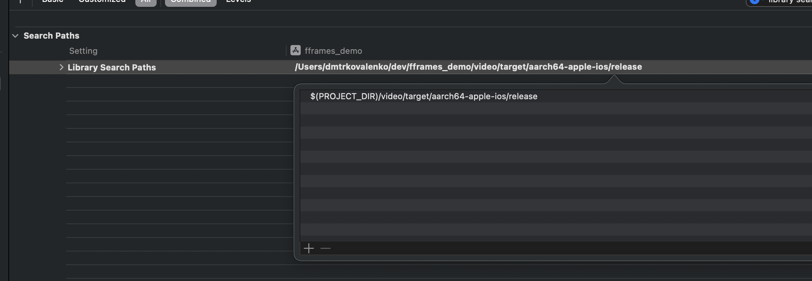
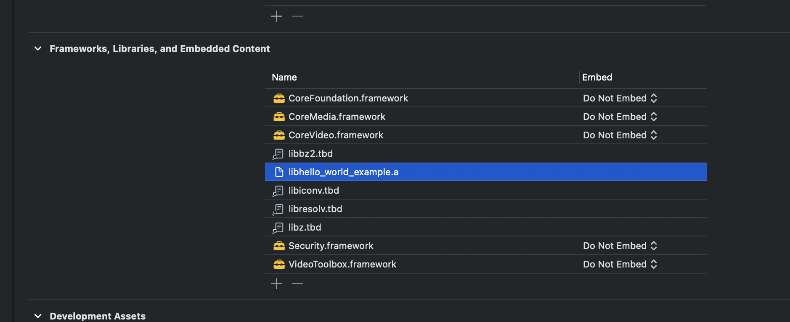

# Build fframes for ios 

This example shows how to cross compile fframes for ios platform and link and use it in an xcode project.

> it is still in beta so access is limited to the beta testers only. Apply for beta test https://fframes.studio/

Clone fframes repository and provide it as a path dependency to the fframes_demo_video crate

```toml

[dependencies]
# provide correct paths
fframaes = { path = "../fframes" }
fframes_renderer = { path = "../../fframes-renderer" }
```

Please make sure that for now you'll need to also change this in the fframe's root cargo toml

```diff

diff --git a/Cargo.toml b/Cargo.toml
index bd64d76..3456f54 100644
--- a/Cargo.toml
+++ b/Cargo.toml
@@ -34,7 +34,7 @@ members = [
 # usvgr = { path = "../svgr/crates/usvgr"}
 svgr = "0.42.2"
 usvgr = "0.42.2"
-ffmpeg-sys-fframes = { version = "7.0.3", features = ["build", "static", "build-lib-x264", "build-lib-x265", "build-lib-opus", "build-license-gpl"] }
+ffmpeg-sys-fframes = { version = "7.0.3", features = ["build", "static"] }
 
 # fframes internal deps 
 fframes-media-loaders = { path = "fframes-media-loaders", version = "1.0.0-beta.1" }
```


Now you need to compile the rust library with statically linked ffmpeg libraries for ios and this all can be done with the following command

```bash
rustup target add aarch64-apple-ios
cargo build  --target aarch64-apple-ios --release
```

make sure that this only works on arm64 macs if you need to compile for x86_64 you need to add the target `x86_64-apple-ios` and run the same command with the target `x86_64-apple-ios` or you can create a universal binary using `lipo` command.

```bash
rustup target add x86_64-apple-ios aarch64-apple-ios
cargo lipo --release
```

Your target folder now should be have `target/aarch64-apple-ios/release/libhello_world_example.a` file. Which is ready to be linked with your xcode project. Please make sure to add it as a framework and add library search path in your xcode project (it is already added in this example).



add it as a dependency to your xcode project



now your project will be able to run the basic version of fframes example.

